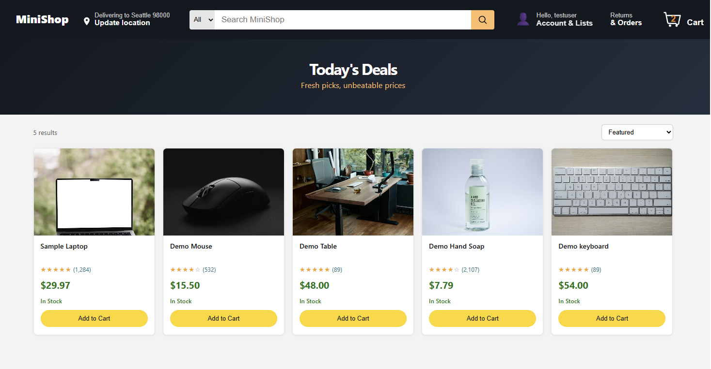

# Mini E-commerce System
A full-stack mini e-commerce application built with Spring Boot + React, featuring customer order flows, admin management workflows, and inventory/order status linkage.
---
## 1. Overview
This project simulates a real e-commerce workflow from both customer and admin perspectives.
- Customer side: browse products, add to cart, checkout, pay pending orders, track order status, request returns
- Admin side: manage products, inventory, order transitions, return approval/refund, users/roles
- Backend enforces status-driven business rules (order + inventory + returns)
---
## 2. Tech Stack
- **Backend:** Java, Spring Boot, Spring Security, JPA/Hibernate
- **Frontend:** React, JavaScript, Vite
- **Database:** MySQL
- **Authentication:** JWT
- **Build Tools:** Maven, npm
## 3. Features
### 3.1 Customer Features
- Product browsing and product detail page
- Cart management and checkout
- Order list with status filter
- Order detail page with status-driven actions
- Payment flow (simulated)
- Return request submission and return status display
### 3.2 Admin Features
- Product management
- Inventory management (receive stock, manual adjust, stock movements)
- Order status updates with valid transitions
- Return workflow (approve/reject/refund)
- User management, role & permission controls, blacklist tools
### 3.3 Inventory + Order Status Linkage
- Allocate stock at checkout
- Fulfill stock when order becomes `SHIPPED`
- Deallocate stock when order becomes `CANCELLED`
  This avoids duplicate stock deduction and keeps inventory state consistent.
---
## 4. Architecture

- **Order lifecycle**: `PENDING -> PAID -> PROCESSING -> SHIPPED -> DELIVERED -> CLOSED` (or `CANCELLED`)
- **Inventory linkage**:
    - allocate at checkout
    - fulfill at `SHIPPED`
    - deallocate at `CANCELLED`
- **Return flow**:
    - user submits `REQUESTED`
    - admin approves/rejects
    - approved return can be marked `REFUNDED`
- **Partial return support** with returnable quantity validation by order item
---
##  5. Project Structure
```
mini-ecommerce/
  backend/      # Spring Boot API
  frontend/     # React app (Vite)
  docs/
    screenshots/   # README images
```
## 6. Getting Started

### 6.1 Prerequisites
- Java 17+
- Node.js 18+
- MySQL 8+
- Maven 3.8+
### 6.2 Database Setup
Create DB:
```sql
CREATE DATABASE mini_ecommerce;
```
Update backend config in backend/src/main/resources/application.yml:

spring.datasource url/username/password
jwt secret and expiry
### 6.3 Backend Setup
```
cd backend

mvn spring-boot:run
```
Backend should run at: 
- http://localhost:8080
### 6.4 Frontend Setup
```
cd frontend
npm install
npm run dev
```
Frontend should run at:

- http://localhost:5173 (or the Vite port shown in terminal)
## 7. API Highlights
### Auth
```text
POST /api/auth/register
POST /api/auth/login
GET  /api/auth/me
```
### Customer Orders
```
GET  /api/orders
GET  /api/orders/{orderId}
POST /api/orders/{orderId}/pay
POST /api/orders/{orderId}/returns
```
### Admin Orders
```
GET  /api/admin/orders
PUT  /api/admin/orders/{orderId}/status
GET  /api/admin/orders/returns
PUT  /api/admin/orders/returns/{returnId}/approve
PUT  /api/admin/orders/returns/{returnId}/reject
PUT  /api/admin/orders/returns/{returnId}/refund
```
### Admin Inventory
```
GET  /api/admin/inventory
GET  /api/admin/inventory/{productId}/movements
POST /api/admin/inventory/{productId}/receive
POST /api/admin/inventory/{productId}/adjust
```
## 8. Demo Screenshots
### 8.1 Product Catalog


### 8.2 Product Detail
### 8.3 Cart / Checkout
### 8.4 Order List with Status Filters
### 8.5 Order Detail + Return Status
### 8.6 Admin Dashboard 
### 8.7 Admin Products (Receive/Adjust/Movements)
### 8.8 Admin Inventory (Receive/Adjust/Movements)
### 8.9 Admin Orders (Status Transition)
### 8.10 Admin Users

## 9. Security & Permissions
- JWT-based authentication for protected APIs
- Admin endpoints protected by role/permission checks
- Unauthorized/forbidden errors handled in frontend flows
